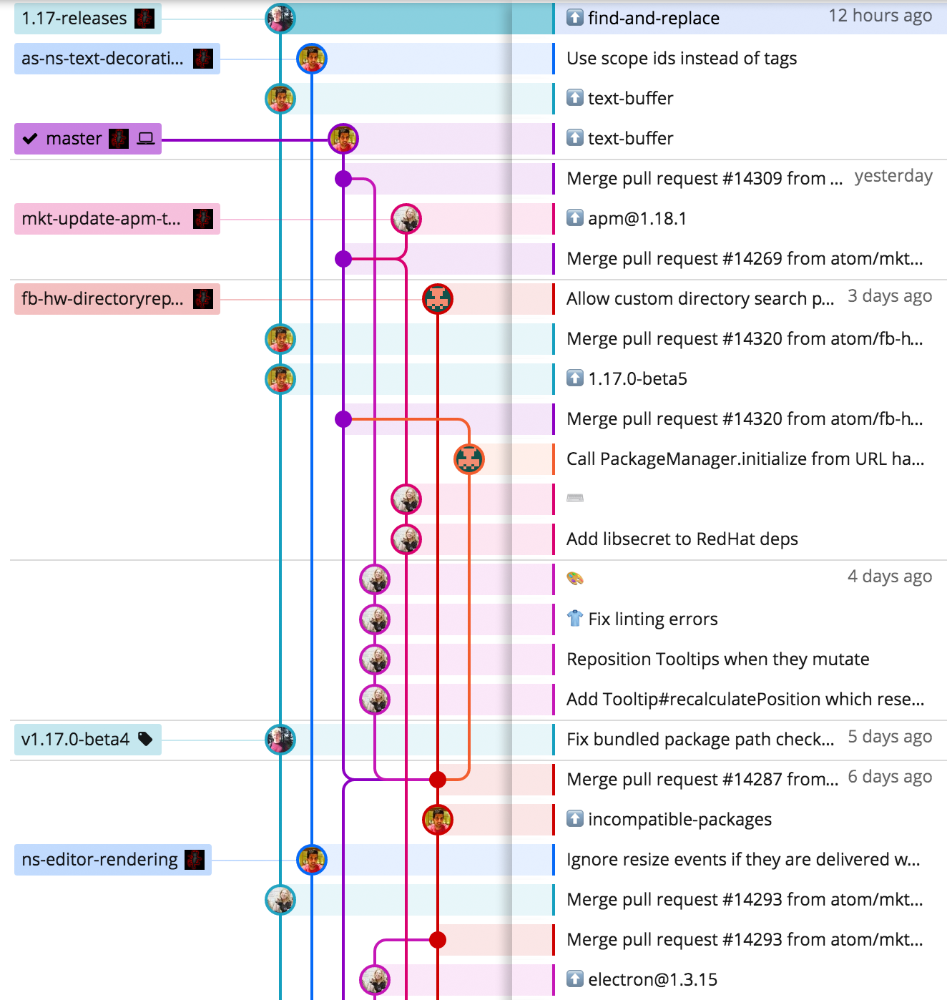
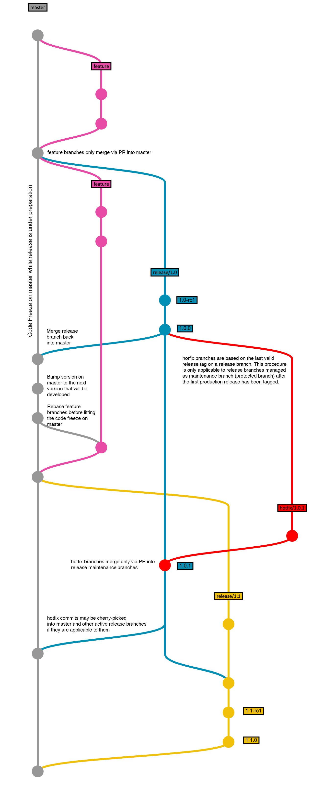

Yes, this is all over again the old discussion about what's the best branching
model for projects using [Git](https://git-scm.com/) as their version control
system. I know, there are countless blog posts
(e. g. [1](https://nvie.com/posts/a-successful-git-branching-model/),
[2](https://guides.github.com/introduction/flow/), or
[3](https://barro.github.io/2016/02/a-succesful-git-branching-model-considered-harmful/))
about that topic out there... yet, I feel most of the discussion is focused on
projects with continuous deployment (i. e. mostly web applications), whereas
classical desktop software with classical release cycles are rather
underrepresented.

First, some thoughts on what I actually need, before creating any new ideas
others put already in the bin due to being unfit... When hacking on a desktop
software or an operating system (i. e. something that will be deployed on
many systems, by many people, without me as developer being aware), it all
comes down to releases. People are used to releases, updates etc. being clearly
labelled with a [semantic version](https://semver.org/) designator. This is no
different from what you should do for SAAS web applications --- what's really
different here is that for desktop applications, several supported versions
can exist in parallel. So for me, a good branching model should

* limit to one eternal branch (have most recent *working* code in `master`)
* use feature branches to change the code in `master`
* support maintenance of several active releases in parallel

So, why not have a look at what are other open source developers doing? Well,
that proved to be easier said than done. I'm quite familiar with
[FreeBSD's branching model](https://www.freebsd.org/doc/en/books/dev-model/release-branches.html),
but it is rather old-school, was ported from CVS to Subversion and seems to have
[some misfits with Git](https://wiki.freebsd.org/GitDrawbacks) (of course the
linked article blames Git, but that means vice versa if Git is otherwise
considered good or is mandatory to be used, the FreeBSD branching model doesn't
fit well with Git).

But what about more recent projects, that were not ported from older version
control systems? Well, there are some, like [Atom](https://atom.io/) and
[Electron](https://electron.atom.io/). Both would be perfect samples, as they
use semantic versions, have no continuous deployment and are managed by
GitHub --- they could be great role models about how Git in general and GitHub
in particular are meant to be used for this type of project. I wrote "would" and
"could" since both projects didn't document their branching model anywhere. Of
course that didn't prevent me from reviewing both projects' repository structure
in order to explore what branches I would find there. For Electron, I couldn't
really figure a structure, but for Atom, there seems to be one:

Seemingly, Atom uses dedicated branches for releases, and tags on these branches
to mark published releases. This would be quite in line with what
[Marcus Geelnard](https://www.bitsnbites.eu/author/m/) proposes in his
[stable mainline branching model for Git](https://www.bitsnbites.eu/a-stable-mainline-branching-model-for-git/).
At a first glance, this seems to be the only acceptable model also satisfying
my third requirement, i. e. the maintenance of several active releases in
parallel, that are not nice sequences. This feels quite close from what I know
from FreeBSD --- `master` corresponds to `head`, and the release branches
correspond to FreeBSD's `releng` branches.

However, there's another branching model that looks quite appealing to me:
[Adam Ruka](https://endoflineblog.com/about)'s
[OneFlow](https://endoflineblog.com/oneflow-a-git-branching-model-and-workflow)
model (the post is quite recent, but the idea of that model already dates back
to his first article on the subject,
[GitFlow considered harmful](https://endoflineblog.com/gitflow-considered-harmful)).
True, in the preamble it already says:

> The main condition that needs to be satisfied in order to use OneFlow for a
> project is that every new production release is based on the previous release
>
> [...]
>
> If your project needs to maintain multiple simultaneous yet incompatible release
> versions that way, then OneFlow won't work for you out of the box.

But is that really true for my projects? For FreeBSD and Python it certainly
is --- both projects work with two major releases, from which they continue to
derive also new minor releases. For my projects however, old versions would
still be supported with patch releases (e. g. in case of a security issue
detected), but new versions would only be derived from the current development
stage, i. e. from what can be found in `master`. So would the OneFlow model
work for me?

Honestly speaking, I can't tell right now. There is one aspect about OneFlow
that intrigues me and at the same raises some questions: It's about merging
back from release and hotfix branches. While I can mostly understand the idea
of merging hotfix stuff back into `master` (you probably want to fix the same
issue also on `master` that you just fixed on a release), I don't understand the
concept of release branches, if they should be merged back. Let's look at
several scenarios:

The trivial one: in preparation for a release, you need to bump the version
number of your project. Fine, but what does in this trivial scenario distinguish
a release branch from a mere feature branch? What is the value added for doing
it that way? I can only imagine it's more convenient for projects with a bad
version information maintainability (e. g. maintaining version information for
several submodules like Electron has to do, or maintaining version information
in several files scattered across the project's source tree). It also would mean
you have to stick to a certain sequence:

* create the release branch
* do your stuff on the release branch (bump version & tag release)
* you can create new feature branches off `master` in the meantime
* merge the release branch back into `master` before any new feature branch
  is allowed to be merged (i. e. apply a code freeze rule for `master`)
* bump the version on `master` to the next RELENG working release
* rebase all feature branches to the bumped `master`
* start merging back feature branches

For me it would feel more natural to have a sequence like this one:

* create a release branch
* bump version on `master` to the next development release
* rebase any feature branch to the bumped `master`
* do whatever has to be done on the release branch (version bump, release
  candidates, ...)
* tag the final version on the release branch

The ugly aspect of this
[cactus model](https://barro.github.io/2016/02/a-succesful-git-branching-model-considered-harmful/)
(that's what [Jussi Judin](https://barro.github.io/author/) calls it) is the
merging effort between the different branches. It allows the `master` branch
to strongly evolve while the release is being finished, which makes it hard to
keep fixes in sync between potentially several release branches, `master` and
feature branches. OneFlow solves this problem, but at the price of a necessary
code freeze in `master` during the release preparation period.

So it all comes down to one question: What happens in my repositories in
preparation for a release, and how strong can the `master` branch evolve during
that time? To be honest, when preparing a release, applying a code freeze on
`master` wouldn't be that terrible a price to pay. Contrariwise, this could
help keeping the discipline to finalize a release before turning attention
towards other ventures, or consequently abandon a release attempt if too much
has to be fixed upfront. So indeed, OneFlow could generally fit my needs.

There's just one point I would handle differently, and that is patch level
releases. For sure, a hotfix or patch release has to be based on the latest
previous release, but that could as well be a hotfix release itself (e. g.
2.3.2 would be based on 2.3.1). OneFlow is not really taking this into
consideration, so for me, I'm more or less back on
[Marcus Geelnard](https://www.bitsnbites.eu/author/m/)'s
[stable mainline branching model for Git](https://www.bitsnbites.eu/a-stable-mainline-branching-model-for-git/),
but with one amendment taken from OneFlow:

So my personal branching model is a mix of the OneFlow and Cactus models:

* New features are developed in feature branches, leaving `master` as single
  eternal branch (in accordance with OneFlow).
* `master` is a protected branch, so features have to be merged by pull requests
  with all applicable code checks (CI, quality reviews) to be passed prior
  merge (my own rule enhancement).
* Alpha and beta pre-releases are managed via tags in `master`. Version bumps
  and tags can be applied either as an override to the protected branch rule by
  a repository administrator, or by using quick & dirty pull requests (idea
  shamelessly stolen from FreeBSD).
* Release branches are branched off `master` after the beta phase has been
  completed (this helps avoiding too many merges and rebasing between the
  different branches).
* Release candidates and the final release are managed as tags in the respective
  release branch.
* While a release branch is going through the pre-release phase, `master` is
  under code freeze (i. e. no pull requests from feature branches shall be
  merged during that time --- that's again my own conclusion).
* After tagging a release branch as final (zero patch release), the release
  branch shall merge back into `master` (introducing fixes made during the
  release candidate phase --- in line with OneFlow).
* Once this merge has happened, the version in `master` shall be bumped to the
  next upcoming release (suffixed with `-pre` or `-dev` --- again shamelessly
  copied from FreeBSD).
* Once this has happened, all active feature branches need to be rebased onto
  the most recent version of `master`. This implicitly also lifts the code
  freeze previously imposed on `master` (again in line with OneFlow).
* From the moment of the final release on, the release branch becomes a residual
  maintenance branch, managed as protected branch (to avoid incidental
  development in the wrong place --- this is my own enhancement to OneFlow).
* Post release patches (i. e. hot fixes) are managed within the residual release
  branch (which becomes a maintenance branch after the final release).

With this set of rules, it should be fairly straight forward to manage projects
with sequential releases, but a need for hotfix releases also for older releases 
otherwise not being developed any further.
