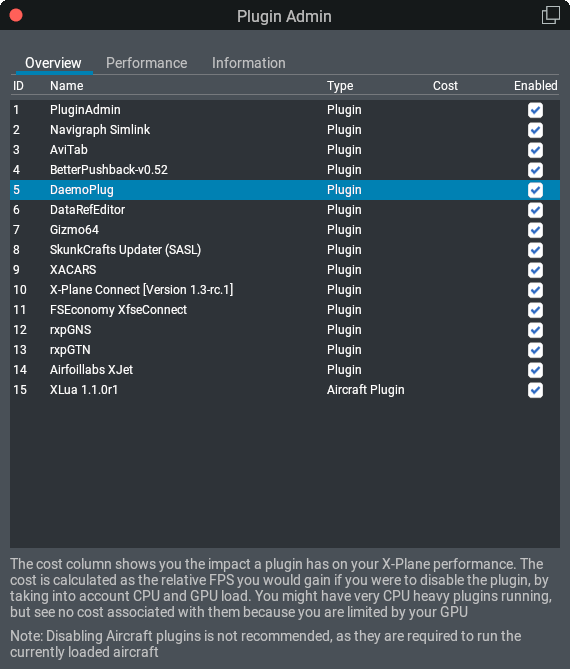

[X-Plane](https://www.x-plane.com) has a well-documented, accessible [API](https://developer.x-plane.com/sdk/), making it relatively easy to write plugins for the simulator. In this post I'm going to demonstrate how a basic plugin boilerplate can look like, and how to build it on different platforms.

Let's get started with some basics: X-Plane plugins are dynamically linked libraries, which are loaded by X-Plane at runtime. They have to provide an API as defined by the X-Plane SDK, so X-Plane can access the plugin via defined entry points. The [API documentation](https://developer.x-plane.com/sdk/) explains all this, and also provides examples for basic and more advanced plugins. For this post I am going to use a very barebone plugin which does nothing except existing in X-Plane.

#### The Furious Five

Any X-Plane plugin has to implement these five callbacks --- together they constitute the most basic API any plugin must implement:

* `XPluginStart` is called to initialize the plugin (e.g. when X-Plane starts)
* `XPluginStop` is called when the plugin is stopped (e.g. when X-Plane shuts down)
* `XPluginEnable` is called whenever the plugin gets enabled (e.g. via the plugin admin, or after having initialized the plugin)
* `XPluginDisable` is called whenever the plugin gets disabled (e.g. when X-Plane's configuration menu is opened)
* `XPluginReceiveMessage` is called when a message is sent to the plugin --- either by X-Plane itself, or by a third-party plugin

A plugin can have and register more callbacks, but these five are the mandatory minimum. An absolute barebone plugin could therefore look like this:

```c
#include <CHeaders/XPLM/XPLMPlugin.h>


PLUGIN_API int XPluginStart(char *outName, char *outSig, char *outDesc)
{
    strcpy(outName, "DaemoPlug");
    strcpy(outSig, "net.daemotron.plugin");
    strcpy(outDesc, "The uber cool plugin that does absolutely nothing.");
    return 1;
}


PLUGIN_API void XPluginStop(void)
{

}

PLUGIN_API void XPluginDisable(void)
{

}


PLUGIN_API int XPluginEnable(void)
{
    return 1;
}


PLUGIN_API void XPluginReceiveMessage(XPLMPluginID inFrom, int inMsg, void *inParam)
{
 
}
```

Of course this code could be written more compactly, but in a fully working plugin, all these API functions will have to be implemented in order to make the plugin actually do something.

#### Organizing Files

There is no best practice on how to organise files of a plugin project. Here I'm just showing you how I do organise things, since it fits well with my way of working. I use git for source code management, and I keep each plugin in its dedicated git repository. For building my plugins, I use [CMake](https://cmake.org). A typical plugin boilerplate using these tools looks like this:

```
+--+ Project Root Directory
   |
   +--+ SDK/
   |
   +--+ src/
   |  |
   |  +-- collisions
   |  |
   |  +-- main.c
   |
   +-- .gitignore
   |
   +-- CMakeLists.txt
```

* The `SDK` folder contains the X-Plane SDK as downloaded from Laminar's [Developer Site](https://developer.x-plane.com/sdk/plugin-sdk-downloads/).
* The `src` folder contains my source code files. I usually call the main file `main.c`, where the Furious Five are implemented.
* The file `src/collisions` holds symbol names the linker needs to know about.
* In the `.gitignore` file, I exclude the SDK and the `build` directory from git, and eventual folders created by an IDE or editor
* The `CMkaeLists.txt` file contains the build instructions for the plugin

The content of the `src/collisions` linker script looks like this:

```text
{
 global:
 XPluginStart;
 XPluginStop;
 XPluginEnable;
 XPluginDisable;
 XPluginReceiveMessage;
 local:
 *;
};
```

#### Building The Plugin On Windows

With ~60%, Windows is the most-used operating system among X-Plane users[^1], so let's start with building the plugin for this platform. Again there are various options which compilers could be used. I picked the [MinGW-w64](https://www.mingw-w64.org/) distribution provided by [WinLibs](https://winlibs.com/). On my system, I have both distributions, the Win64 and Win32 variant. The Win32 variant is only needed when building plugins for older versions of X-Plane (prior to 10.20). In this example I'm going to focus on the 64 bit variant only --- X-Plane 11 and newer only work with 64 bit plugins.

For this example, I used the *GCC 12.2.0 + LLVM/Clang/LLD/LLDB 15.0.6 + MinGW-w64 10.0.0 (UCRT) - release 3* package in Win64 flavour. Installing is straightforward: simply download the package and extract it with [7zip](https://www.7-zip.org/). I usually keep my MinGW installations directly on `C:\`, so this one lives at `C:\mingw64` on my system. To make the tools accessible on the command line, you'll need to add `C:\mingw64\bin` to your `PATH` environment variable. That's it already, installation done.

[CMake](https://cmake.org) comes with its own installer, so setting it up on Windows is easy and straight forward. In addition I use [cmder](https://cmder.app/) as console emulator on Windows --- IMO much more comfortable than the default command line, but of course the normal command line will do as well.

Before we can build the plugin, we will need to create some build instructions, helping CMake understand what we expect it to do. Here's a simple `CMakeLists.txt` file I used to compile the example plugin:

```cmake
cmake_minimum_required (VERSION 3.2)

set(CMAKE_C_COMPILER "gcc")
set(CMAKE_CXX_COMPILER "g++")

project (DaemoPlug)

# Detect SDK
get_filename_component(SDK_PATH "./SDK/" ABSOLUTE)
message("-- Detecting X-Plane SDK path")

if(NOT EXISTS ${SDK_PATH})
    message(FATAL_ERROR "Missing SDK folder: ${SDK_PATH}")
endif(NOT EXISTS ${SDK_PATH})

# Copy symbol collisions file
configure_file("src/collisions" "collisions" COPYONLY)

# Global compiler flags
set (GCC_DEFAULT_FLAGS -std=c17 -Wall -Wunreachable-code -pipe -Wextra -Wshadow -Wfloat-equal -pedantic -fvisibility=hidden -O2 -fmessage-length=0 -D_FORTIFY_SOURCE=2 -fstack-protector -funwind-tables -fasynchronous-unwind-tables -W -DXPLM200 -DXPLM210)
set (GXX_DEFAULT_FLAGS -std=c++17 -Wall -Wunreachable-code -pipe -Wextra -Wshadow -Wfloat-equal -pedantic -fvisibility=hidden -O2 -fmessage-length=0 -D_FORTIFY_SOURCE=2 -fstack-protector -funwind-tables -fasynchronous-unwind-tables -W -DXPLM200 -DXPLM210)

# Include files
include_directories ("./src")
include_directories ("${SDK_PATH}")
include_directories ("${SDK_PATH}/CHeaders/XPLM")
include_directories ("${SDK_PATH}/CHeaders/Wrappers")
include_directories ("${SDK_PATH}/CHeaders/Widgets")

file(GLOB_RECURSE SOURCES "src/*.c")

if(WIN32)
    cmake_policy(SET CMP0015 NEW)
    set (CMAKE_C_COMPILER x86_64-w64-mingw32-gcc)
    set (CMAKE_CXX_COMPILER x86_64-w64-mingw32-g++)
    link_directories("${SDK_PATH}/Libraries/Win")
    add_library(WIN_RELEASE_64 SHARED ${SOURCES})
    target_compile_options(WIN_RELEASE_64 PRIVATE ${GCC_DEFAULT_FLAGS} -s -c -fno-stack-protector -static-libgcc -static-libstdc++ -DXPLM200 -DIBM)
    target_link_libraries(WIN_RELEASE_64 XPLM_64 XPWidgets_64 -static-libgcc -static-libstdc++)
    set_target_properties(WIN_RELEASE_64 PROPERTIES LINK_FLAGS "-s -Wl,--version-script=collisions")
    set_target_properties(WIN_RELEASE_64 PROPERTIES PREFIX "")
    set_target_properties(WIN_RELEASE_64 PROPERTIES SUFFIX "")
    set_target_properties(WIN_RELEASE_64 PROPERTIES LIBRARY_OUTPUT_DIRECTORY "DaemoPlug/64/")
    set_target_properties(WIN_RELEASE_64 PROPERTIES OUTPUT_NAME "win.xpl")
endif()
```

This CMake file instructs CMake to

1. use `gcc` as compiler
2. detect the SDK path
3. define global compiler flags, including the X-Plane API versions we want to use (`-DXPLM200`)
4. define include directories including our source folder and the SDK headers
5. consider all `*.c` files in `src/` as source files
6. explicitly use the 64 bit mingw compilers on Windows
7. build a shared library linked against the Windows-specific libraries in the SDK, and name it `win.xpl`

You can amend all this to your needs --- you can add the `XPLM300`, `XPLM301` and `XPLM303` APIs if you want to address only X-Plane 11.50 and newer, or use the Fat Plugins (XPLM 3.0 API) format instead of the Fat Plugins (XPLM 2.1 API) format used in the example above.

To build the plugin, issue these instructions on a command line in the project folder:

```cmd
mkdir build
cd build
cmake -G "MinGW Makefiles" ../
mingw32-make
```

#### Does It Work?

Now we have build our plugin, it's time to see if it actually loads in X-Plane. in `X-Plane/Resources/plugins` create a folder `DaemoPlug` (or whatever you'd like to call it), and a subfolder `64`. Copy the freshly created `win.xpl` file into that subfolder and launch X-Plane. In X-Plane's log file, you should find a line similar to this one:

```txt
Loaded: D:\X-Plane 12/Resources/plugins/DaemoPlug/64/win.xpl (net.daemotron.plugin).
```

Also in the Plugin Admin window X-Plane will show you the plugin:



#### Building on Mac and Linux

To build the plugin on Mac or Linux, the respective build tools have to be installed. For Mac, this would be [Xcode](https://developer.apple.com/xcode/) (or at least the Xcode command line tools), and on Linux, at least GCC and GNU make would be required (Ubuntu provides all required tools in the [build-essential](https://packages.ubuntu.com/jammy/build-essential) package).

Also currently our CMakeLists.txt only covers building on Windows. Adding these parts to the bottom of the file will enable builds on Linux and Mac:

```cmake
if(LINUX)
    add_library(LIN_RELEASE_64 SHARED ${SOURCES})
    target_compile_options(LIN_RELEASE_64 PRIVATE ${GCC_DEFAULT_FLAGS} -m64 -fPIC -DLIN)
    set_target_properties(LIN_RELEASE_64 PROPERTIES LINK_FLAGS "-Wl,--version-script=collisions")
    set_target_properties(LIN_RELEASE_64 PROPERTIES PREFIX "")
    set_target_properties(LIN_RELEASE_64 PROPERTIES SUFFIX "")
    set_target_properties(LIN_RELEASE_64 PROPERTIES LIBRARY_OUTPUT_DIRECTORY "DaemoPlug/64/")
    set_target_properties(LIN_RELEASE_64 PROPERTIES OUTPUT_NAME "lin.xpl")
endif()

if(APPLE)
    cmake_policy(SET CMP0042 NEW)
    set (CMAKE_SYSTEM_NAME Darwin)
    set (CMAKE_CXX_COMPILER g++)
    set (CMAKE_OSX_ARCHITECTURES "x86_64;arm64")
    add_library(MAC_RELEASE_64 SHARED ${SOURCES})
    target_compile_options(MAC_RELEASE_64 PRIVATE ${GCC_DEFAULT_FLAGS} -nostdinc++ -I/Library/Developer/CommandLineTools/usr/include/c++/v1 -DXPLM200 -DAPL)
    target_link_libraries(MAC_RELEASE_64 "-F${SDK_PATH}/Libraries/Mac" "-framework XPLM" "-framework XPWidgets" "-framework OpenGL" "-nodefaultlibs" "-lc++" "-lc++abi" "-lm" "-lc")
    set_target_properties(MAC_RELEASE_64 PROPERTIES LINK_FLAGS "-m64 -fvisibility=hidden")
    set_target_properties(MAC_RELEASE_64 PROPERTIES PREFIX "")
    set_target_properties(MAC_RELEASE_64 PROPERTIES SUFFIX "")
    set_target_properties(MAC_RELEASE_64 PROPERTIES LIBRARY_OUTPUT_DIRECTORY "DaemoPlug/64/")
    set_target_properties(MAC_RELEASE_64 PROPERTIES OUTPUT_NAME "mac.xpl")
endif()
```

Building the plugin on these systems is similar to Windows, with just one difference --- they use `(g)make` instead of `mingw32-make`:

```bash
mkdir build
cd build
cmake ../
make
```

[^1]: Source: [X-Plane Usage Data](http://dashboard.x-plane.com/)